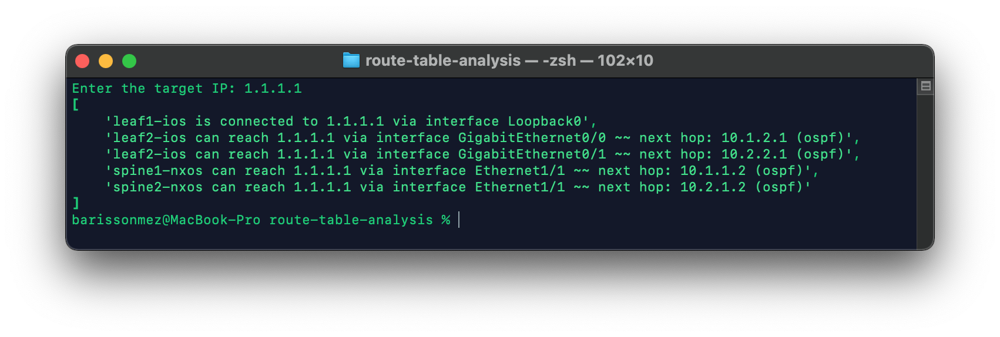
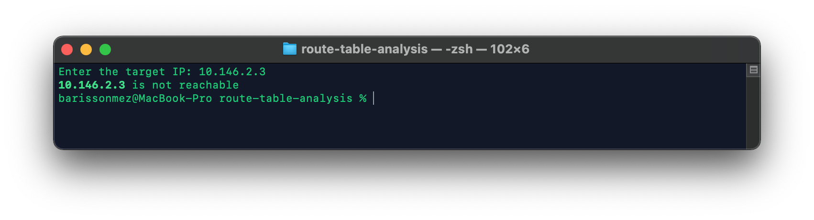

# Route Table Analysis Toolkit #

By using this toolkit, you will be able to parse routing table and determine if target IP find a match 






## Installation ##

To install the toolkit and the associated modules, please perform the following from within your virtual environment:  

1) Clone the repository to the machine on which you will run the application from:

```git
git clone https://github.com/sbarissonmez/route-table-analysis.git
cd route-table-analysis
```

2) Populate your Nornir inventory files:

    - [groups.yaml](inventory/groups.yaml)
    - [hosts.yaml](inventory/hosts.yaml)

See the [Inventory Setup](#inventory-setup) below for more detailed instructions

3) Create the virtual environment to run the application in:

```console
virtualenv --python=`which python3` venv
source venv/bin/activate
```
4) Install the requirements:

***Language :***
```
Python3.8+
```

***Library :***

```python
pip install -r requirements.txt
```

requirements.txt
```
nornir
nornir_scrapli
rich
genie
pyats
-r requirements-genie.txt
```

requirements-genie.txt
```
genie>=20.2 ; sys_platform != "win32" and python_version < "3.10"
pyats>=20.2 ; sys_platform != "win32" and python_version < "3.10"
```


