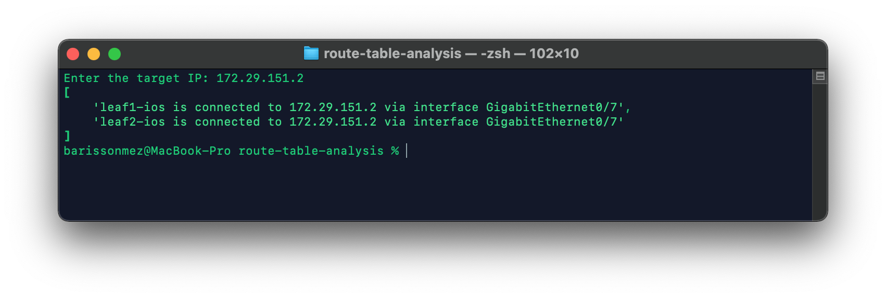

# Route Table Analysis Toolkit #

With the help of this toolkit, it is possible to extract routing table information and check if a specified target IP matches any of the prefixes. This can be accomplished by parsing the routing table of each device using the Scrapli library, and then iterating through the prefixes to find a match. If a match is found, the script will determine the interface through which the target IP is reachable, as well as the next hop information. Finally, the script will display the result in a user-friendly format.

